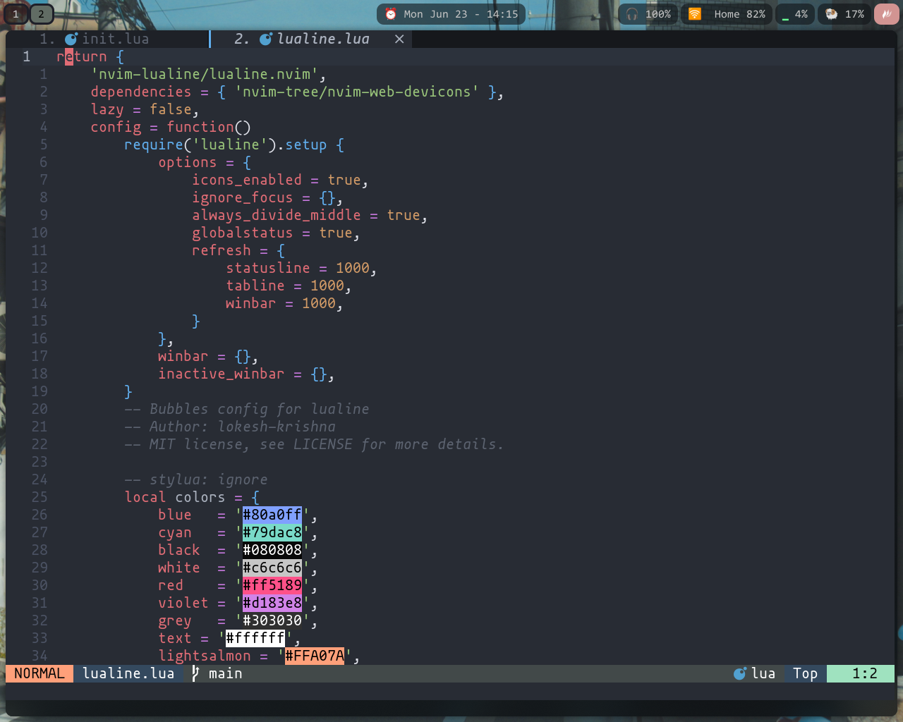

### NEOVIM
This is a custom neovim config, designed for my personal use.
I do not recommand using it for anybody other then myself.

It's good to go for Zig, Python and lua development.


### Installation
1. Install neovim by your package manager.
2. clone this repo and rename it to `nvim` in your dots directory.

This command does all that for you
```
git clone https://github.com/santraj611/neovim.git ~/.config/nvim
```

### Somethings about this repo
It usage Lazy plugin manager to manage plugins.
And there is about 25 plugins as of now.
And comes with lsp setup right out of the box.
